# RCA Configurable Quote Comparison Tool

A Salesforce Lightning Web Component (LWC) for performing a detailed, side-by-side comparison of two Quotes and their related records.

This tool is designed to be highly configurable by Salesforce Administrators using standard, declarative tools (Field Sets and Custom Metadata Types), eliminating the need for code changes to modify the comparison view. The solution is built to be generic; it can compare fields from the Quote, any of its parent objects, and any of its direct child or grandchild objects simply by adding the correct configuration.

## ✨ Features

- **Side-by-Side View**: Compares two quotes in a clear, two-column layout
- **Intra-Opportunity Comparison**: Easily compare different quote versions or options for the same sales deal
- **Fully Generic**: Compare fields from any standard or custom object that is a parent, child, or grandchild of the Quote
- **Hierarchical Display**: Natively supports and displays parent, child, and grandchild relationships
- **Admin-Friendly Configuration**: No code changes are needed to add, remove, or reorder fields and objects in the comparison
  - Field Sets control which fields are displayed for each object
  - Custom Metadata Types control which objects are included in the comparison
- **Quick Action Launch**: Easily accessible from a Quick Action on the Quote record page
- **Native Look and Feel**: Built using the Salesforce Lightning Design System (SLDS) for a seamless user experience

## 🚀 How to Use

1. Navigate to any Quote record
2. Click the **Compare Quote** button (you may need to click the dropdown arrow to see all actions)
3. A modal window will open. The current Quote is pre-selected as "Quote 1"
4. In the "Comparison Quote" input, search for and select the second Quote you wish to compare. This is ideal for comparing alternative quotes within the same Opportunity
5. Click the **Compare** button
6. The side-by-side comparison view will load with the data configured in the Field Sets

## 🛠️ Installation & Configuration Guide

Follow these steps to set up the tool in your Salesforce org.

### Prerequisites

- Salesforce org with Lightning Experience enabled
- System Administrator or equivalent permissions
- Salesforce CLI (for deployment) or access to deploy via Change Sets

### Step 1: Deploy Components

Deploy this package to your Salesforce org using one of the following methods:

#### Option A: Using Salesforce CLI (Recommended)

```bash
# Clone this repository
git clone <repository-url>
cd rca-quote-comparison-tool

# Deploy to your org (replace YOUR_ORG_ALIAS with your actual org alias)
sfdx force:source:deploy -p force-app -u YOUR_ORG_ALIAS

# Or deploy using the manifest
sfdx force:source:deploy -x manifest/package.xml -u YOUR_ORG_ALIAS
```

#### Option B: Using Workbench or Developer Console

1. Download the metadata files from this repository
2. Create a deployment package containing:
   - `RCA_QuoteComparisonController.cls` and its metadata file
   - `rca_quoteComparator` Lightning Web Component bundle
   - `RCA_Comparison_Object__mdt` Custom Metadata Type and its fields
   - Sample Custom Metadata records

### Step 2: Configure Objects to Compare

For each object you want to include in the comparison, create a record in the **RCA_Comparison_Object__mdt** Custom Metadata Type.

**Navigation**: Setup → Custom Code → Custom Metadata Types → Manage Records (next to RCA_Comparison_Object)

#### Example Configuration:

| Label | Object API Name | Relationship Type | Relationship Name | Parent Identifier Field | Display Order |
|-------|----------------|-------------------|-------------------|-------------------------|---------------|
| Opportunity | Opportunity | Parent | OpportunityId | | 10 |
| Quote | Quote | Self | | | 20 |
| Quote Line Items | QuoteLineItem | Child | QuoteLineItems | | 30 |
| Line Attributes | QuoteLineItemAttribute | Child | | QuoteLineItemId | 40 |

#### Field Descriptions:

- **Object API Name**: The API name of the Salesforce object (e.g., Quote, Opportunity, QuoteLineItem)
- **Relationship Type**: 
  - `Self`: The Quote object itself
  - `Parent`: Objects that the Quote has a lookup relationship to (e.g., Opportunity)
  - `Child`: Objects that have a lookup relationship to Quote or its children
- **Relationship Name**: The field name that creates the relationship (e.g., OpportunityId for parent relationships)
- **Parent Identifier Field**: For grandchild objects, the field that identifies the direct parent (e.g., QuoteLineItemId for line item attributes)
- **Display Order**: Numeric value controlling the order sections appear in the comparison view

### Step 3: Configure Fields to Compare

For each object you configured in Step 2, create a Field Set with the exact API Name **RCA_Comparison**.

1. Navigate to **Setup → Object Manager** and select the object (e.g., Quote)
2. Go to the **Field Sets** section and click **New**
3. Enter the following details:
   - **Field Set Label**: RCA Comparison
   - **Field Set Name**: RCA_Comparison
4. Drag the fields you want to display from the palette into the "In the Field Set" container
5. The order of fields in the list determines their display order in the UI
6. Click **Save**
7. Repeat this process for all objects you wish to compare

#### Recommended Field Sets:

**Quote Object (RCA_Comparison Field Set):**
- Name
- QuoteNumber
- Status
- ExpirationDate
- TotalPrice
- Discount
- Tax
- GrandTotal

**Opportunity Object (RCA_Comparison Field Set):**
- Name
- StageName
- Amount
- CloseDate
- Probability
- Type
- LeadSource

**QuoteLineItem Object (RCA_Comparison Field Set):**
- Product2Id (Product Name)
- Quantity
- UnitPrice
- TotalPrice
- Discount
- Description

### Step 4: Quick Action Setup

The **Compare Quote** Quick Action is automatically deployed with the package and will be available on Quote records. However, you need to add it to your page layouts to make it visible.

#### Add Quick Action to Page Layout

1. Navigate to **Setup → Object Manager → Quote**
2. Go to **Page Layouts** and select the layout you want to modify
3. In the palette, select **Mobile & Lightning Actions**
4. Drag the **Compare Quote** action into the "Salesforce Mobile and Lightning Experience Actions" section at the top of the page layout
5. Click **Save**

**Note**: The Quick Action is automatically created during deployment and configured to launch the `rca_quoteComparator` Lightning Web Component.

## ⚙️ Technical Architecture

The RCA Quote Comparison Tool follows a modular, service-oriented architecture that separates concerns and promotes maintainability.

### 🏗️ Architectural Overview

```mermaid
graph TD
    A["🎯 rca_quoteComparator<br/>(Parent Orchestrator)"] --> B["📋 rcaQuoteSelection<br/>(Quote Selection)"]
    A --> C["📊 rcaComparisonDisplay<br/>(Comparison Results)"]
    C --> D["📄 rcaComparisonSection<br/>(Individual Section)"]
    
    A --> E["⚡ RCA_QuoteComparisonController<br/>(Main Controller)"]
    E --> F["⚙️ RCA_ConfigurationService<br/>(Metadata & Field Sets)"]
    E --> G["🔍 RCA_QueryBuilderService<br/>(Dynamic SOQL)"]
    E --> H["🔄 RCA_DataProcessorService<br/>(Result Processing)"]
    E --> I["📦 RCA_DataStructures<br/>(Data Models)"]
    
    F --> J["🗃️ RCA_Comparison_Object__mdt<br/>(Configuration)"]
    F --> K["📋 Field Sets<br/>(RCA_Comparison)"]
    
    style A fill:#e1f5fe
    style B fill:#f3e5f5
    style C fill:#f3e5f5
    style D fill:#f3e5f5
    style E fill:#fff3e0
    style F fill:#e8f5e8
    style G fill:#e8f5e8
    style H fill:#e8f5e8
    style I fill:#e8f5e8
    style J fill:#fce4ec
    style K fill:#fce4ec
```



### Backend Design: Modular Apex Services

The backend follows a service-oriented architecture with clear separation of concerns:

#### **RCA_QuoteComparisonController.cls** (Main Orchestrator)
- Handles API requests from LWC
- Orchestrates calls to service classes
- Contains no business logic - pure orchestration
- Validates inputs and handles errors

#### **RCA_ConfigurationService.cls** (Configuration Management)
- Manages Custom Metadata Type queries
- Handles Field Set discovery and processing
- Validates configuration completeness
- Builds field definitions from field sets

#### **RCA_QueryBuilderService.cls** (Dynamic SOQL Generation)
- Builds dynamic SOQL queries based on configuration
- Handles different relationship types (Self, Parent, Child)
- Executes queries and returns structured results
- Supports complex parent-child-grandchild relationships

#### **RCA_DataProcessorService.cls** (Data Processing)
- Transforms query results into UI-friendly structures
- Groups child and grandchild records appropriately
- Maps relationships between quotes and related objects
- Processes different relationship patterns

#### **RCA_DataStructures.cls** (Data Models)
- Centralized data structure definitions
- Wrapper classes for API responses
- Query parameter and result containers
- Ensures consistent data contracts

### Frontend Design: Parent-Child LWC Components

The frontend uses a hierarchical component structure for better maintainability:

#### **rca_quoteComparator** (Parent Component)
- Main orchestrator component exposed as Quick Action
- Manages application state and data flow
- Handles API calls to Apex controller
- Coordinates child component interactions

#### **rcaQuoteSelection** (Quote Selection)
- Handles quote selection interface
- Manages record picker interactions
- Emits selection events to parent
- Contains action buttons for compare/cancel

#### **rcaComparisonDisplay** (Comparison Results)
- Displays comparison results layout
- Manages header and navigation
- Coordinates multiple comparison sections
- Handles back/close navigation

#### **rcaComparisonSection** (Individual Sections)
- Renders individual object comparisons
- Handles parent/child record display
- Manages field value formatting
- Supports grandchild record hierarchies

### Key Architectural Benefits

- **Separation of Concerns**: Each class/component has a single responsibility
- **Loose Coupling**: Components communicate via well-defined interfaces
- **High Cohesion**: Related functionality is grouped together
- **Testability**: Each service can be unit tested independently
- **Maintainability**: Changes are isolated to specific components
- **Reusability**: Child components can be reused in other contexts
- **Scalability**: Easy to add new features without modifying existing code

## 🔒 Security Considerations

- **Apex Sharing**: The controller class is declared `with sharing` to enforce the running user's record-level access
- **Field Level Security (FLS)**: FLS is automatically respected through dynamic SOQL and standard LWC components
- **CRUD Permissions**: Users must have Read access to all configured objects and fields
- **Data Isolation**: Only data the user has access to will be queried and displayed

## 🔧 Customization Options

### Adding New Objects

1. Create a new record in `RCA_Comparison_Object__mdt`
2. Create an `RCA_Comparison` Field Set on the new object
3. Deploy the changes (no code modifications required)

### Modifying Displayed Fields

1. Edit the `RCA_Comparison` Field Set for the relevant object
2. Add, remove, or reorder fields as needed
3. Changes take effect immediately (no deployment required)

### Styling Customizations

The component uses standard Lightning Design System classes. To customize:

1. Modify the CSS in `rca_quoteComparator.html`
2. Follow SLDS guidelines for consistent styling
3. Test across different screen sizes

## 🐛 Troubleshooting

### Common Issues:

**"No comparison objects configured" Error:**
- Ensure `RCA_Comparison_Object__mdt` records exist
- Verify the records have the correct Object API Names

**Fields Not Displaying:**
- Check that `RCA_Comparison` Field Set exists for the object
- Verify field-level security permissions
- Ensure fields exist in the Field Set

**Quick Action Not Visible:**
- Confirm the Quick Action was added to the page layout
- Check that the Lightning Component is properly deployed
- Verify user has access to the Quote object

**Performance Issues:**
- Review Field Set configurations to include only necessary fields
- Consider the number of child records being compared
- Check for governor limit warnings in debug logs

## 📝 Version History
- **v1.0.0**: Initial release with core comparison functionality
- Support for Quote, Opportunity, and QuoteLineItem objects
- Configurable via Custom Metadata Types and Field Sets
- Lightning Web Component with modal interface

## 🤝 Contributing

1. Fork the repository
2. Create a feature branch
3. Make your changes
4. Test thoroughly in a scratch org
5. Submit a pull request with detailed description

## 📄 License

This project is licensed under the MIT License - see the LICENSE file for details.

## 🆘 Support

For questions, issues, or feature requests:
1. Check the troubleshooting section above
2. Review existing GitHub issues
3. Create a new issue with detailed information about your environment and the problem

---

**Built with ❤️ for the Salesforce Community**